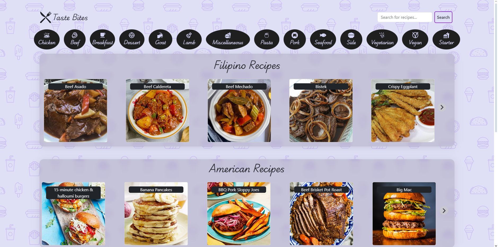
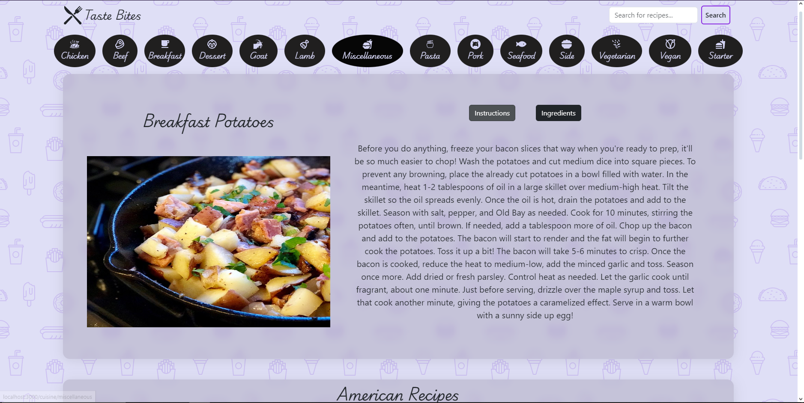

# Recipe App

Welcome to the Recipe App! 🍲

## Overview

This is a React-based application that allows users to search for recipes and display them by category or region. Built with Bootstrap, Hero Patterns, and several other modern libraries, the app provides a clean and interactive user experience.

## Features

- **Search for Recipes:** Find recipes by ingredient or dish name.
- **Browse by Category:** View recipes categorized by type (e.g., Chicken, Beef, Seafood).
- **Explore by Region:** Discover recipes from different areas around the world.
- **Responsive Design:** Optimized for both desktop and mobile devices.

## Technologies Used

- **React:** For building the user interface.
- **Bootstrap:** For responsive and styled components.
- **Hero Patterns:** For background patterns to enhance visual design.
- **Splide:** For creating carousel sliders.
- **React Icons:** For including various icons in the app.
- **Motion:** For smooth animations and transitions.
- **React Router / Browser Router:** For routing and navigation within the app.

- 
## GIF Demo

## Overview

